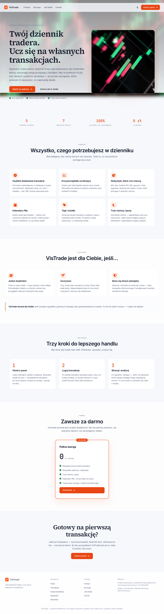
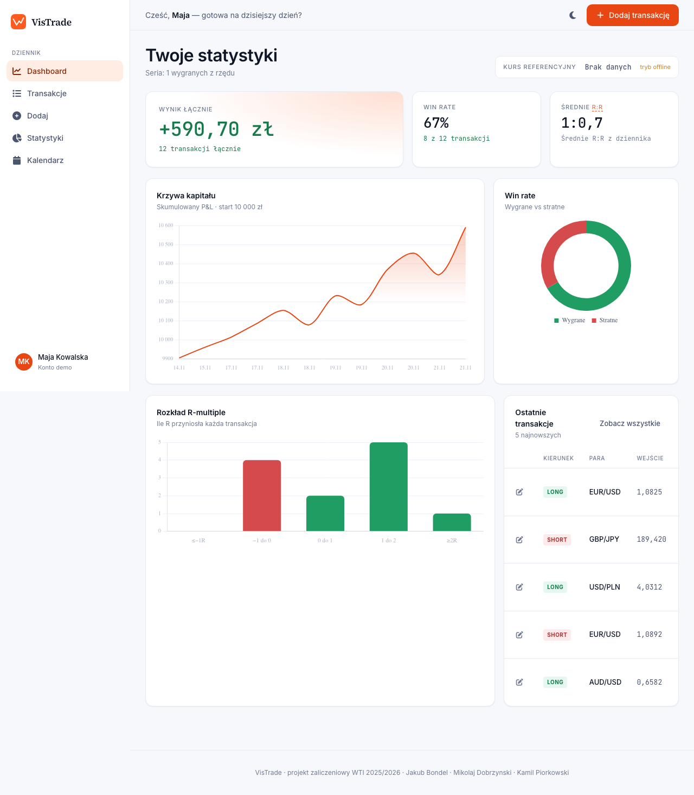
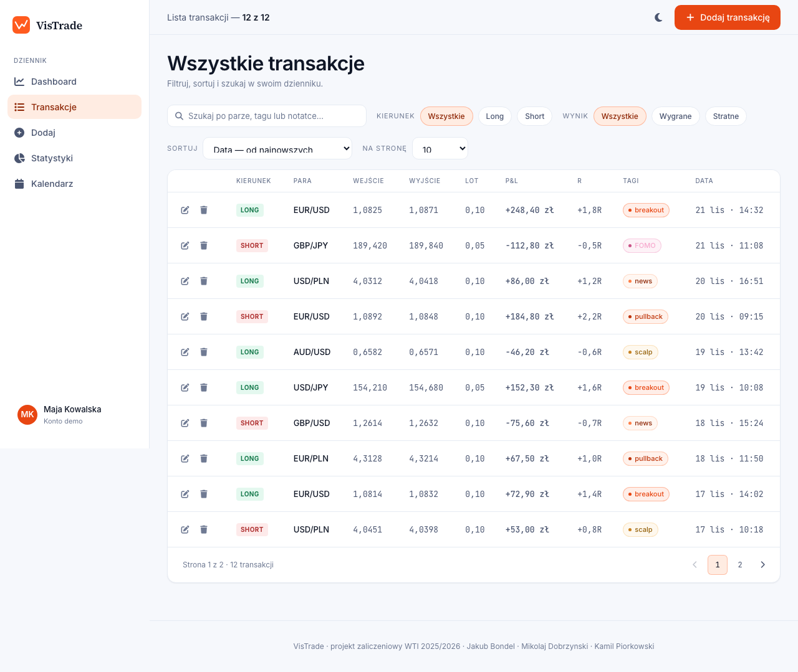
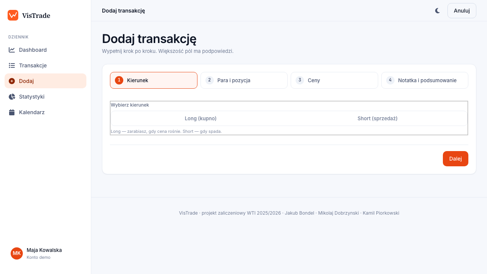
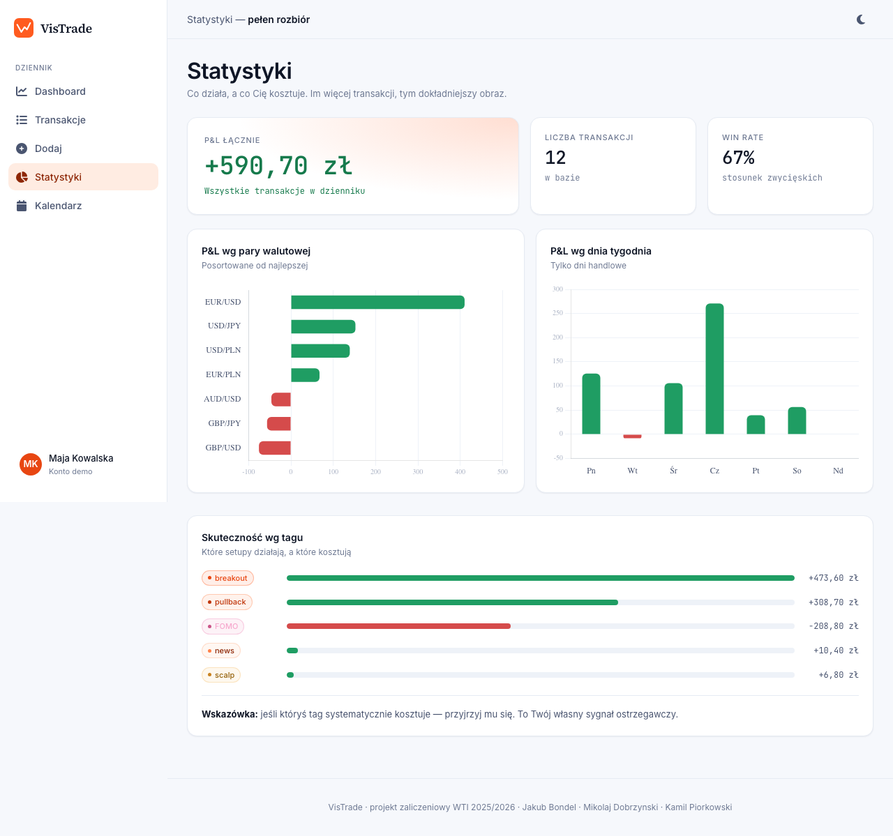
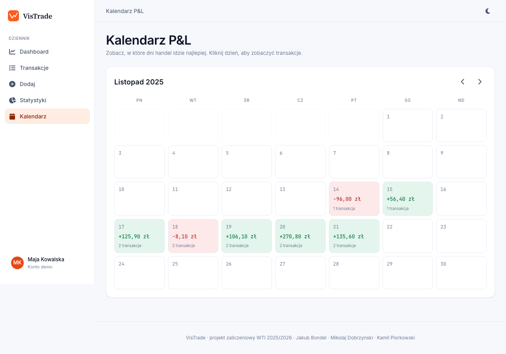

# VisTrade - dziennik tradera forex

VisTrade to aplikacja webowa do prowadzenia dziennika transakcji forex. Projekt
pomaga zapisywac transakcje, analizowac wyniki i szybciej zauwazac powtarzajace
sie bledy. Interfejs jest spokojny wizualnie, responsywny i w pelni po polsku.

> Projekt zaliczeniowy z przedmiotu **Wprowadzenie do Technologii Internetowych**,
> rok akademicki 2025/2026, prowadzacy: dr inz. Karol Struniawski.

## Link do live demo

[https://piorkowskikamil.github.io/VisTrade/html/strona-glowna.html](https://piorkowskikamil.github.io/VisTrade/html/strona-glowna.html)

## Autorzy

- **Jakub Bondel** - HTML i struktura stron · GitHub: [@w84kubus](https://github.com/w84kubus)
- **Mikolaj Dobrzynski** - CSS, wyglad i responsywnosc · GitHub: [@mikdob00](https://github.com/mikdob00)
- **Kamil Piorkowski** - JavaScript, logika aplikacji i localStorage · GitHub: [@PiorkowskiKamil](https://github.com/PiorkowskiKamil)

## Technologie

- HTML5: semantyczne znaczniki, `lang="pl"`, meta viewport, atrybuty ARIA
- CSS3: zmienne CSS, Flexbox, Grid, media queries, animacje, tryb jasny/ciemny
- JavaScript ES6+: moduly, `async/await`, `localStorage`, Fetch API, RegExp
- Chart.js 4 - wykresy statystyk
- Google Fonts - Inter, Source Serif 4, JetBrains Mono
- Font Awesome - ikony
- Frankfurter API - kursy walut bez klucza API

## Funkcjonalnosci

- [x] 6 widokow: strona glowna, panel, transakcje, dodawanie, statystyki, kalendarz
- [x] dodawanie, edycja i usuwanie transakcji
- [x] wieloetapowy formularz z walidacja RegExp
- [x] wyszukiwarka, filtry, sortowanie i paginacja transakcji
- [x] modal potwierdzajacy usuniecie oraz modal szczegolow dnia w kalendarzu
- [x] wykresy: krzywa kapitalu, win rate, rozklad R, P&L wedlug pary i dnia tygodnia
- [x] kalendarz P&L z kolorami zysku i straty
- [x] kursy walut pobierane przez Fetch API z fallbackiem do cache
- [x] zapis transakcji w `localStorage`
- [x] zapis preferencji motywu w `localStorage` i cookie
- [x] responsywny uklad: sidebar na desktopie, dolna nawigacja na telefonie
- [x] polskie formatowanie liczb, dat i komunikatow

## Uruchomienie

Aplikacja uzywa modulow ES (`<script type="module">`), dlatego trzeba uruchomic
ja przez lokalny serwer HTTP. Otwieranie plikow przez `file://` moze zablokowac
ladowanie modulow JavaScript.

```bash
# 1. Wejdz do katalogu projektu
cd VisTrade

# 2. Uruchom lokalny serwer
python3 -m http.server 8080

# 3. Otworz strone startowa
open http://localhost:8080/html/strona-glowna.html
```

Mozna tez uzyc rozszerzenia **Live Server** w VS Code.

Przy pierwszym uruchomieniu aplikacja zapisuje 12 przykladowych transakcji do
`localStorage`, zeby od razu bylo widac dane w panelu i na wykresach.

## Widoki

- `html/strona-glowna.html` - strona produktowa z opisem aplikacji
- `html/panel.html` - panel z KPI, wykresami i ostatnimi transakcjami
- `html/transakcje.html` - tabela transakcji z filtrami i paginacja
- `html/dodaj.html` - formularz dodawania oraz edycji transakcji
- `html/statystyki.html` - dodatkowe wykresy i analiza tagow
- `html/kalendarz.html` - kalendarz P&L z modalem szczegolow dnia

## Uwagi projektowe

Strona glowna uzywa pelnoekranowego tla z wykresem swiecowym, zeby od razu
pokazac kontekst forex. Sam panel aplikacji jest spokojniejszy: ciemne tlo,
proste karty, czytelne liczby i ograniczona liczba ozdobnikow.

Projekt nie jest usluga finansowa i nie daje sygnalow inwestycyjnych. To tylko
narzedzie edukacyjne do zapisywania i analizowania wlasnych transakcji.

## Screenshots








## Struktura projektu

```text
VisTrade/
├── html/
│   ├── strona-glowna.html      # strona startowa
│   ├── panel.html              # glowny panel aplikacji
│   ├── transakcje.html         # lista transakcji
│   ├── dodaj.html              # formularz dodawania/edycji
│   ├── statystyki.html         # statystyki i wykresy
│   └── kalendarz.html          # kalendarz P&L
├── css/
│   ├── tokeny.css              # kolory, fonty, spacing, zmienne CSS
│   ├── baza.css                # reset i podstawowe style
│   ├── uklad.css               # sidebar, topbar i responsywny layout
│   ├── komponenty.css          # przyciski, karty, modal, toast, chipy
│   ├── strony.css              # tabele, formularz, kalendarz, statystyki
│   └── strona-glowna.css       # style landing page
├── js/
│   ├── dom.js                  # pomocnicze funkcje DOM
│   ├── formatowanie.js         # formatowanie liczb i dat
│   ├── przechowywanie.js       # wrapper na localStorage i cookie
│   ├── dane-startowe.js        # przykladowe transakcje
│   ├── motyw.js                # tryb jasny/ciemny
│   ├── transakcje.js           # CRUD i obliczenia statystyk
│   ├── walidacja.js            # walidacja formularza
│   ├── kursy.js                # pobieranie kursow walut
│   ├── wykresy.js              # konfiguracja Chart.js
│   ├── nawigacja.js            # aktywny link i topbar
│   ├── renderowanie-transakcji.js
│   ├── interfejs.js            # modal i toast
│   └── pages/
│       ├── strona-glowna.js
│       ├── panel.js
│       ├── transakcje.js
│       ├── dodaj.js
│       ├── statystyki.js
│       └── kalendarz.js
├── assets/
│   ├── logo/
│   │   ├── znak-vistrade.svg
│   │   └── logotyp-vistrade.svg
│   ├── img/
│   │   └── wykres-swiecowy.jpg
│   ├── video/
│   │   └── tlo-startowe.mp4
│   └── screenshots/
│       ├── strona-glowna.png
│       ├── panel.png
│       ├── transakcje.png
│       ├── dodaj.png
│       ├── statystyki.png
│       └── kalendarz.png
├── README.md
└── .gitignore
```
